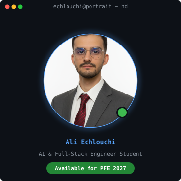

### <code>echlouchi@github ~ $ ./contributions.sh</code>

  

### <code>echlouchi@github ~ $ whoami --neofetch</code>
<table>
  <tr>
    <td valign="top" align="center">
      
    </td>
    <td valign="top">
      
    </td>
  </tr>
</table>

 

<h3 align="center"><code>echlouchi@github ~ $ cat skills.json</code></h3>

  
  
  
  
  
  
  
  

---

  Built with Python & SVG animation · Auto-refreshed daily via GitHub Actions

